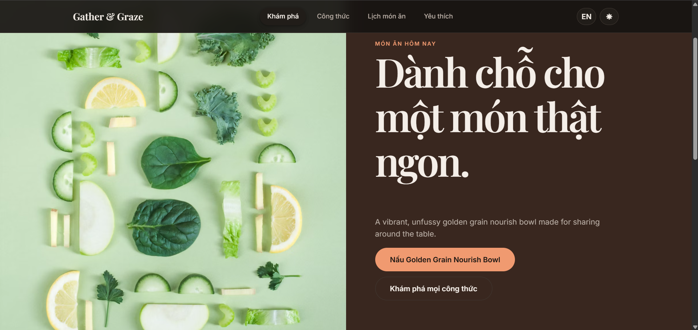
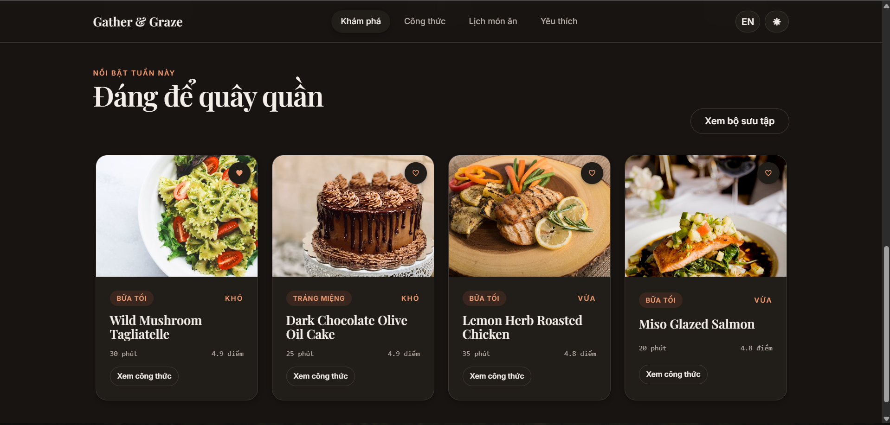
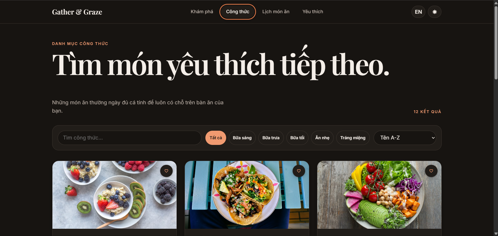
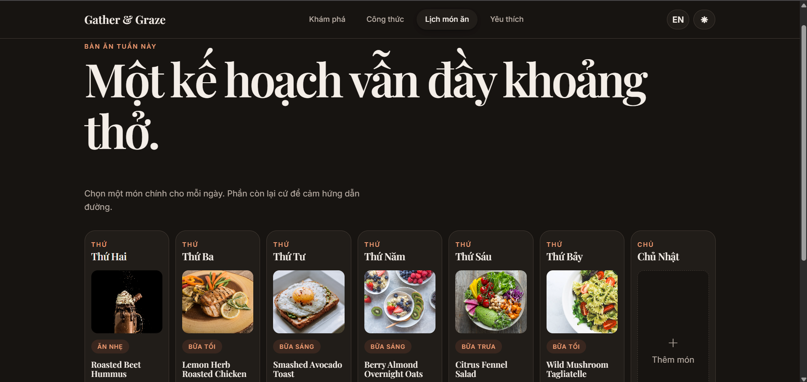
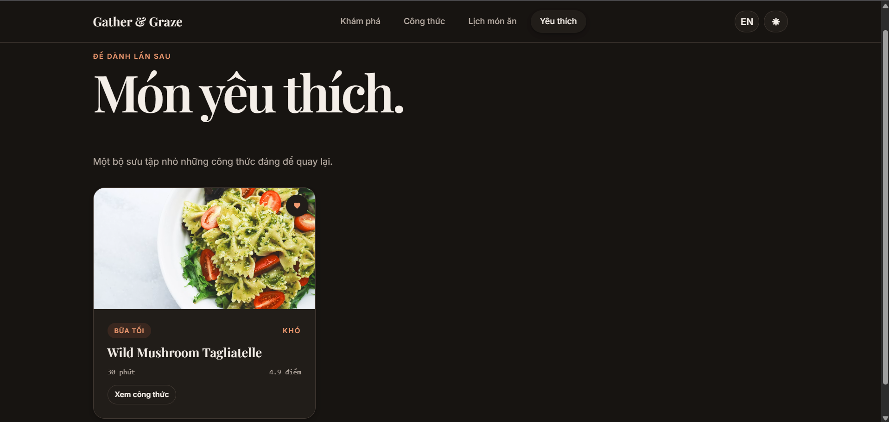
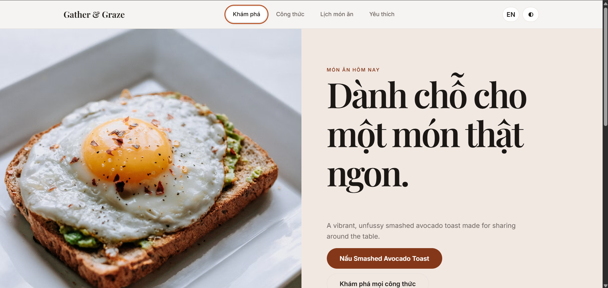

# Gather & Graze

Gather & Graze là ứng dụng web quản lý công thức và lập kế hoạch bữa ăn được xây dựng dưới dạng React SPA. Dự án tập trung trình diễn kỹ năng thiết kế UX/UI, tổ chức component React và quản lý trạng thái phía client.

Ứng dụng cho phép người dùng khám phá công thức, tìm kiếm và lọc món ăn, lưu món yêu thích, xem hướng dẫn nấu chi tiết và lên lịch món ăn cho từng ngày trong tuần. Toàn bộ dữ liệu được mô phỏng ở frontend và không yêu cầu backend.

## Live Demo

[Trải nghiệm Gather & Graze trên Vercel](https://huynh-cong-y-demo-uxui-rhyoih5g6.vercel.app/)

## Preview

### Trang chủ - Dark mode



### Công thức nổi bật



### Danh mục công thức



### Lịch món ăn



### Món yêu thích



### Trang chủ - Light mode



## Tech Stack

- **React 18:** xây dựng giao diện bằng functional components
- **React Router v6:** điều hướng giữa các trang trong SPA
- **Vite:** môi trường phát triển và production build
- **JavaScript:** ngôn ngữ chính của dự án
- **Pure CSS:** design system, responsive layout và animations
- **Context API:** quản lý trạng thái dùng chung
- **localStorage:** lưu món yêu thích, lịch món ăn, ngôn ngữ và giao diện
- **ESLint:** kiểm tra chất lượng mã nguồn

## Features

- Trang chủ editorial với món ăn nổi bật, thống kê và danh sách phổ biến
- Danh sách 12 công thức món ăn từ mock data
- Tìm kiếm công thức theo tên với debounce
- Lọc theo danh mục và sắp xếp theo tên, thời gian chuẩn bị hoặc đánh giá
- Trang chi tiết công thức với nguyên liệu, hướng dẫn và điều chỉnh khẩu phần
- Đánh dấu hoàn thành từng bước nấu ăn
- Thêm hoặc xóa công thức khỏi danh sách yêu thích
- Lập kế hoạch món ăn từ Thứ Hai đến Chủ Nhật
- Thêm, thay đổi hoặc xóa món ăn trong lịch tuần
- Chuyển đổi ngôn ngữ Tiếng Việt và Tiếng Anh
- Chuyển đổi giao diện sáng và tối
- Lưu trạng thái người dùng bằng `localStorage`
- Loading skeleton, empty state và route transition
- Responsive trên desktop, tablet và mobile
- Modal hỗ trợ focus trap, phím `Escape` và thao tác bàn phím

## React Concepts Used

- **Functional Components:** toàn bộ giao diện được xây dựng bằng function components
- **Props:** truyền dữ liệu và callback vào các component tái sử dụng
- **`useState`:** quản lý bộ lọc, tìm kiếm, modal, khẩu phần và mobile navigation
- **`useEffect`:** mô phỏng tải dữ liệu, đồng bộ theme, ngôn ngữ và scroll restoration
- **`useContext`:** chia sẻ recipes, favorites, meal plan và UI preferences
- **`useReducer`:** quản lý trạng thái hoàn thành các bước nấu ăn
- **`useMemo`:** tính dữ liệu thống kê, món nổi bật và danh sách sau khi lọc
- **`useCallback`:** giữ ổn định các hàm cập nhật trạng thái dùng chung
- **Custom Hooks:** `useLocalStorage`, `useDebounce` và `useFilter`
- **React Router:** định tuyến và truyền tham số recipe ID qua URL
- **Error Boundary:** hiển thị trạng thái dự phòng khi route gặp lỗi
- **Controlled Components:** quản lý input, select và các bộ lọc bằng React state

## Installation

### Yêu cầu

- Node.js 20.19 trở lên
- npm

### Cài đặt và chạy

```bash
git clone <repository-url>
cd HuynhCongY-Demo-UXUI
npm install
npm run dev
```

Sau khi chạy, mở địa chỉ được Vite hiển thị trong terminal, thường là:

```text
http://localhost:5173
```

### Kiểm tra chất lượng

```bash
npm run lint
npm run build
```

### Xem production build

```bash
npm run preview
```

Để khôi phục dữ liệu mẫu, xóa các key bắt đầu bằng `gather:` trong `localStorage` của trình duyệt.
